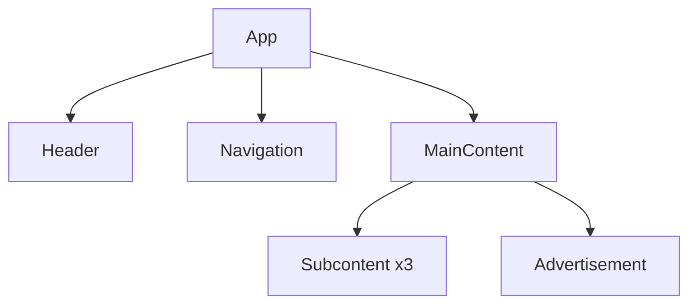

# 🧱 React Blocks Project

[](https://reactjs.org/)
[](https://vitejs.dev/)
[](https://www.w3.org/Style/CSS/)

A modern recreation of the "Plotting your Blocks" assignment using React Components and CSS styling. This project showcases component-based architecture and CSS styling capabilities in React.

## 🚀 Features

- Modular component architecture
- Responsive layout design
- Reusable components
- Clean CSS styling

## 📁 Project Structure

```
react-blocks/
├── src/
│   ├── components/
│   │   ├── Header.jsx
│   │   ├── Navigation.jsx
│   │   ├── MainContent.jsx
│   │   ├── Subcontent.jsx
│   │   └── Advertisement.jsx
│   ├── App.jsx
│   └── App.css
```

## 🔨 Component Hierarchy



## 🧩 Components Overview

- **App**: Root component orchestrating the main layout
- **Header**: Top section component
- **Navigation**: Left sidebar component
- **MainContent**: Central area component
- **Subcontent**: Reusable content blocks (3 instances)
- **Advertisement**: Bottom section component

## 💻 Technologies Used

- **React 18**: UI component library
- **Vite**: Next-generation frontend tooling
- **CSS3**: Styling and layout

## 📚 Learning Outcomes

✅ Component-based architecture implementation  
✅ Functional component creation and nesting  
✅ CSS styling in React context  
✅ Component reusability patterns  
✅ Modern React development practices

## 🚦 Getting Started

1. Clone the repository
2. Install dependencies: `npm install`
3. Run development server: `npm run dev`
4. Open browser at: `http://localhost:5173`

## 📝 License

This project is open source and available under the [MIT License](LICENSE).

